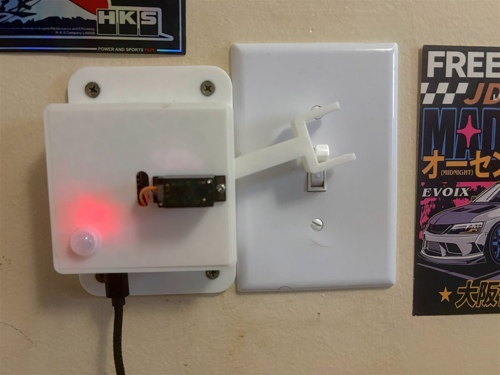

# Motion Light Controller

Built by Eben Siyabalapitiya

An ESP32 reads a PIR motion sensor and drives a servo that physically flips my wall light switch. Nothing in the build touches mains wiring, the switch still works by hand, and the light shuts off on its own after a set period with no motion.

## Why a servo instead of a relay

The usual way to automate a light is to wire a relay into the switch box. I didn't want to do that. Splicing into 120V means the whole thing has to be right the first time, and if the board locks up or the code has a bug, you're left with a light you can't control at all.

Putting a servo on top of the faceplate avoids both problems. The build never comes near mains voltage, and the switch stays a normal switch. If the ESP32 is unplugged, or the WiFi is down, or I've broken something while editing the firmware, I can still reach over and flip it like always. The servo horn sits in a slot around the toggle rather than clamping to it, so there's no fight between the motor and my hand.

## Hardware

| Part | Notes |
|---|---|
| ESP32 dev board (38-pin) | 2.4GHz WiFi, powered over USB-C from a wall charger |
| AM312 PIR sensor | 3.3V native, roughly 3 to 5 metre range, no trim pots |
| MG90S servo | Metal gear. A plastic-gear SG90 strips on a wall toggle |
| Status LEDs | Green solid when the light is on, red slow blink when idle |
| Printed bracket | Clamps to the faceplate screws, positions the horn over the toggle |

## Wiring

| From | To |
|---|---|
| PIR VCC | 3V3 |
| PIR GND | GND |
| PIR OUT | GPIO 27 |
| Servo red | 5V |
| Servo brown | GND |
| Servo orange | GPIO 18 |
| Green LED (via 220Ω) | GPIO 5 |
| Red LED (via 220Ω) | GPIO 4 |

## How it works

The PIR output goes high when it sees a warm body move across its detection zones. The firmware doesn't count down from a fixed number when that happens. Instead it stores a timestamp of the last time motion was seen and compares it against `millis()` on every loop. Each new reading pushes that timestamp forward, so the shutoff deadline keeps sliding as long as someone is in the room. The light only actually turns off once the sensor has been quiet for the full duration.

Turning the light off manually while motion sensing is active would normally bounce it straight back on, since the sensor is still looking at you. A short suppression window after a manual off handles that.

The servo detaches after every move. Holding position draws current continuously and makes the motor buzz, and there's no reason to hold once the toggle has flipped.

## Remote control

The first version ran a web server directly on the ESP32. That works, but only on the same network, since the board sits behind a home router with no address the outside world can reach.

The current version uses MQTT through a HiveMQ Cloud broker. The ESP32 connects outward to the broker over TLS and holds that connection open, which sidesteps NAT entirely. The control page connects to the same broker over secure WebSockets. Neither side ever connects directly to the other. Commands go to `eben/light/cmd`, state comes back on `eben/light/state`.

Two MQTT features do real work here. State is published as a retained message, so the page loads with the current state instead of an empty UI waiting for the next update. And the ESP32 registers a Last Will message on connect, so if it loses power the broker announces that on its behalf and the page shows the device as offline within about thirty seconds.

## Control panel

Two HTML files hosted on GitHub Pages, dark theme throughout, no build step or framework. The main page has an animated SVG of the switch plate that flips in time with the actual servo and picks up an amber glow when the light is on. The idea was that you're looking at a picture of the thing on my wall rather than a generic dashboard toggle.

Controls are a manual on/off button, a switch to disable motion sensing entirely, and preset shutoff delays. The countdown ticks locally in the browser and resyncs from the device every few seconds. A small link in the corner takes you to the motion log page, and the log page links back the same way.

No external dependencies beyond MQTT.js. An earlier version pulled a font from Google Fonts, which turned out to block script execution when the request was slow, leaving the page rendered but permanently stuck on "connecting." System fonts now. A control panel for a device on your own network shouldn't need the internet to render.

## Motion log

A second page that keeps a running history of when the PIR actually caught someone. It doesn't log every trigger, since walking around a room for five minutes would otherwise turn into dozens of near-identical entries. Instead each motion event resets a fifteen-minute cooldown, so what gets logged is closer to "someone entered the room" than a raw motion feed. The light itself still behaves normally in between, this cooldown only affects what gets written to the log, not whether the light turns on.

Entries are kept for 48 hours on a rolling basis, so day three quietly drops day one instead of the log growing forever. The whole thing lives in RAM on the ESP32, no SD card or flash writes, so a reboot clears it, which was a deliberate tradeoff for simplicity over surviving power cuts.

Getting real timestamps out of a board with no clock meant adding an NTP sync on boot, set to Eastern time with daylight saving handled automatically. That same clock is also what makes the quiet hours schedule below possible.

## Quiet hours

Motion sensing turns itself off automatically at 9am and back on at 6pm. It's the same toggle as the manual "motion sensing" switch on the control panel, the schedule just flips it on a timer instead of me having to remember to do it. I can still override it by hand in either direction during the day, it just resets at the next 9am or 6pm boundary.

## Things that went wrong

**Sensor stuck high.** The PIR read HIGH constantly and never dropped, so the shutoff timer could never elapse. I assumed it was the warmup period first, since AM312s hold their output high for 30 to 60 seconds after power-on while the sensor settles. It wasn't. Switching the pin from `INPUT` to `INPUT_PULLDOWN` was the diagnostic that mattered: a floating ESP32 input drifts high on its own, so if a pulldown doesn't bring it to zero, the sensor isn't driving the line. A jumper had come loose. The lesson was to print the raw pin value instead of inferring the sensor state from what the servo was doing.

**Servo direction backwards.** Mounted mirrored from what I'd assumed. Fixed by making the "up" angle a lower number than the "down" angle rather than remounting anything.

**Page stuck connecting.** Covered above. The page rendered fine, which made it look like a network problem rather than a blocked script.

## Setup

1. Install the ESP32Servo and PubSubClient libraries through the Arduino Library Manager.
2. Create a free HiveMQ Cloud Serverless cluster and add a credential with publish and subscribe permission on `eben/light/#`.
3. Fill the WiFi and broker details into the top of the sketch, and the same broker details into both `index.html` and `log.html`.
4. Flash the ESP32 and check the serial monitor for `mqtt connecting... ok`.
5. Open `index.html` locally to test, then host both files wherever you like. They link to each other by relative path, so keep them in the same folder.

The credentials in the HTML files are visible to anyone who views source. That's unavoidable for a browser MQTT client with no backend. The account is scoped to a single topic on a throwaway broker, and the worst it allows a stranger is flipping a bedroom light. Use a password you don't use anywhere else.

## Roadmap

- Certificate pinning instead of `setInsecure()`
- Persisting the motion log to flash so a reboot doesn't wipe the two-day history

---

Built and maintained by Eben Siyabalapitiya.
